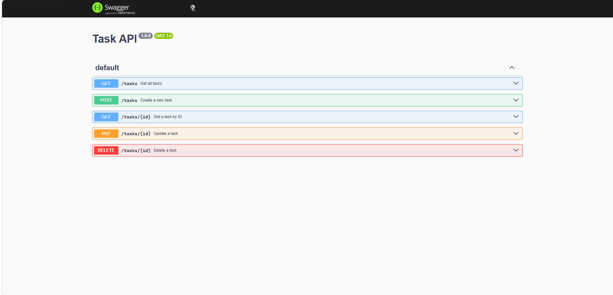

# Task API

A simple RESTful Task API built with **Node.js** and **Express.js** as part of the FlyRank Backend Internship assignments.

The project started as a complete CRUD API using an in-memory array in Week 1. In Week 2, the API was upgraded to use a persistent SQLite database, with SQL queries used for creating, reading, updating, and deleting tasks.

## Features

- RESTful API built with Express.js
- Complete CRUD operations
- Request validation
- Appropriate HTTP status codes
- Swagger UI / OpenAPI documentation
- API testing with `curl -i`
- Persistent SQLite database
- SQL-based CRUD operations
- Database exploration using DB Browser for SQLite

## Technologies

- Node.js
- Express.js
- SQLite
- better-sqlite3
- Swagger UI Express
- OpenAPI 3.0
- JavaScript

---

# Week 1 — Assignment 1: In-Memory CRUD API

The first assignment focused on building a RESTful Task API using an in-memory array.

## Features

- RESTful API built with Express.js
- In-memory task storage
- Complete CRUD operations
- Request validation
- Appropriate HTTP status codes
- Swagger UI / OpenAPI documentation
- API testing with `curl -i`

## Technologies

- Node.js
- Express.js
- Swagger UI Express
- OpenAPI 3.0
- JavaScript

## Installation

Clone the repository:

```bash
git clone https://github.com/yosefalsharawy/flyrank-crud-api.git
cd flyrank-crud-api
```

Install the dependencies:

```bash
npm install
```

## Running the API

Start the server:

```bash
npm start
```

The server runs on:

```text
http://localhost:3000
```

## API Endpoints

| Method | Endpoint     | Description         | Success | Errors   |
| ------ | ------------ | ------------------- | ------- | -------- |
| GET    | `/`          | Get API information | 200     | —        |
| GET    | `/health`    | Check server status | 200     | —        |
| GET    | `/tasks`     | Get all tasks       | 200     | —        |
| GET    | `/tasks/:id` | Get a task by ID    | 200     | 404      |
| POST   | `/tasks`     | Create a new task   | 201     | 400      |
| PUT    | `/tasks/:id` | Update a task       | 200     | 400, 404 |
| DELETE | `/tasks/:id` | Delete a task       | 204     | 404      |

## Task Format

A task has the following structure:

```json
{
	"id": 1,
	"title": "Learn Express",
	"done": false
}
```

## Creating a Task

### Request

```http
POST /tasks
Content-Type: application/json
```

Request body:

```json
{
	"title": "Learn Swagger"
}
```

### Response

```json
{
	"id": 4,
	"title": "Learn Swagger",
	"done": false
}
```

The API returns:

- `201 Created` when the task is created successfully.
- `400 Bad Request` when the title is missing, empty, or not a string.

## Updating a Task

A task can be updated by changing its `title`, `done` status, or both.

Example:

```http
PUT /tasks/4
Content-Type: application/json
```

Request body:

```json
{
	"done": true
}
```

Response:

```json
{
	"id": 4,
	"title": "Learn Swagger",
	"done": true
}
```

The API returns:

- `200 OK` when the task is updated successfully.
- `400 Bad Request` for an invalid or empty request body.
- `404 Not Found` when the task does not exist.

## Deleting a Task

```http
DELETE /tasks/4
```

Successful deletion returns:

```text
204 No Content
```

with an empty response body.

An unknown task ID returns:

```text
404 Not Found
```

## Swagger UI

Interactive API documentation is available at:

```text
http://localhost:3000/docs
```

Swagger UI provides a **Try it out** button for testing all five task endpoints directly from the browser.



## curl Testing

The API was also tested using `curl -i` to verify the HTTP status codes.

Example of creating a task:

```bash
curl -i -X POST http://localhost:3000/tasks -H "Content-Type: application/json" -d "{\"title\":\"curl test task\"}"
```

Response:

```text
HTTP/1.1 201 Created

X-Powered-By: Express

Content-Type: application/json; charset=utf-8

{"id":4,"title":"curl test task","done":false}
```

The complete CRUD cycle was also verified using `curl -i`:

```text
POST /tasks       → 201 Created
GET /tasks/4      → 200 OK
PUT /tasks/4      → 200 OK
GET /tasks/4      → 200 OK
DELETE /tasks/4   → 204 No Content
GET /tasks/4      → 404 Not Found
```

## Week 1 Project Structure

```text
flyrank-crud-api/

│
├── server.js
├── openapi.json
├── package.json
├── package-lock.json
├── README.md
├── swagger.png
└── .gitignore
```

## Week 1 Notes

- Tasks were stored in memory and were reset whenever the server restarted.
- No database was required for this assignment.
- Swagger documentation was defined in `openapi.json`.

---

# Week 2 — Assignment 2: SQL Database

The second assignment builds on the CRUD API from Week 1.

The goal was to replace the temporary in-memory task storage with a persistent SQLite database and learn how the API communicates with a database using SQL.

The same API and project were continued rather than creating a new project.

## Stage 0 — Create SQLite Database

- Installed `better-sqlite3`.
- Created `tasks.db`.
- Created the `tasks` table.
- Added the following columns:
  - `id` — integer primary key generated by SQLite
  - `title` — text
  - `done` — boolean stored as `0` or `1`

- Added three example tasks only when the table is empty.
- Verified that restarting the application does not duplicate the seed tasks.

### Checkpoint

Restarted the application three times and confirmed that the database still contained exactly three tasks.

**Commit:** `Stage 0: create SQLite database`

---

## Stage 1 — Read from the Database

The API was changed to read tasks directly from SQLite instead of the in-memory array.

### Get all tasks

`GET /tasks` uses:

```sql
SELECT * FROM tasks;
```

The endpoint now returns whatever data is currently stored in the database.

### Get one task

`GET /tasks/:id` uses a parameterized query:

```sql
SELECT * FROM tasks WHERE id = ?;
```

The `?` is a parameterized query placeholder. The ID is passed separately rather than being directly inserted into the SQL string.

Unknown task IDs continue to return:

```json
{
	"error": "Task not found"
}
```

with a `404 Not Found` status.

### Checkpoint

Verified that:

```text
GET /tasks
```

returns the tasks stored in `tasks.db`, and that an unknown task ID still returns `404`.

**Commit:** `Stage 1: database read endpoints`

---

## Stage 2 — Insert into the Database

`POST /tasks` was changed to store new tasks in SQLite instead of pushing them into an in-memory array.

### Insert query

```sql
INSERT INTO tasks (title, done) VALUES (?, ?);
```

SQLite automatically generates the task ID.

The existing validation from Week 1 was kept:

- Missing or empty `title` → `400 Bad Request`
- Invalid title → `400 Bad Request`
- Successful creation → `201 Created`
- The response includes the new database-generated ID.

### Checkpoint

Created multiple tasks, stopped the server, started it again, and ran `GET /tasks`.

The created tasks were still present, confirming that the data now survives server restarts.

**Commit:** `Stage 2: insert into database`

---

## Stage 3 — Update and Delete with SQL

The remaining CRUD operations were changed to use SQLite.

### Update a Task

`PUT /tasks/:id` uses:

```sql
UPDATE tasks SET title = ?, done = ? WHERE id = ?;
```

Unknown task IDs return `404`.

Invalid request bodies return `400`.

A successful update returns the updated task.

### Delete a Task

`DELETE /tasks/:id` uses:

```sql
DELETE FROM tasks WHERE id = ?;
```

Unknown task IDs return `404`.

A successful deletion returns:

```text
204 No Content
```

with an empty response body.

### Checkpoint

Created a task, marked it as completed using `PUT`, then deleted it and confirmed each operation using `GET /tasks`.

The server was also restarted between operations to confirm that the database state persisted.

**Commit:** `Stage 3: update and delete with SQL`

---

## Stage 4 — Explore SQLite by Hand

Opened `tasks.db` in **DB Browser for SQLite** and interacted with the database directly through the **Execute SQL** tab.

The following SQL queries were explored:

### List all tasks

```sql
SELECT * FROM tasks;
```

Returns every task stored in the table.

### List completed tasks

```sql
SELECT * FROM tasks WHERE done = 1;
```

Returns only tasks whose `done` value is `1`.

### Count the tasks

```sql
SELECT COUNT(*) FROM tasks;
```

Returns the total number of tasks in the table.

### Mark every task as completed

```sql
UPDATE tasks SET done = 1;
```

Updates every task so that `done` becomes `1`.

### Delete completed tasks

```sql
DELETE FROM tasks WHERE done = 1;
```

Deletes every task whose `done` value is `1`.

### Checkpoint

One query I ran:

```sql
SELECT * FROM tasks WHERE done = 1;
```

This returned the tasks that were currently marked as completed in the SQLite database.

After changing the database directly in DB Browser, I called:

```text
GET /tasks
```

through the API and saw the change immediately without restarting the server.

This demonstrated that the API and DB Browser are both working with the same SQLite database file. There is no separate syncing process; the database is the single source of truth.

**Commit:** `Stage 4: explored SQLite`

---

# Current Project Structure

The project now contains the SQLite database in addition to the files from Week 1:

```text
flyrank-crud-api/

│
├── server.js
├── openapi.json
├── tasks.db
├── package.json
├── package-lock.json
├── README.md
├── swagger.png
└── .gitignore
```

# Project Progress

```text
Week 1 — Assignment 1
        ↓
In-memory CRUD API
        ↓
Swagger / OpenAPI
        ↓
Validation & HTTP status codes
        ↓
Week 2 — Assignment 2
        ↓
SQLite database
        ↓
SQL read operations
        ↓
SQL insert operations
        ↓
SQL update & delete operations
        ↓
Manual SQL exploration
```

The project has progressed from a temporary in-memory CRUD API to a persistent, database-backed API using SQLite.
