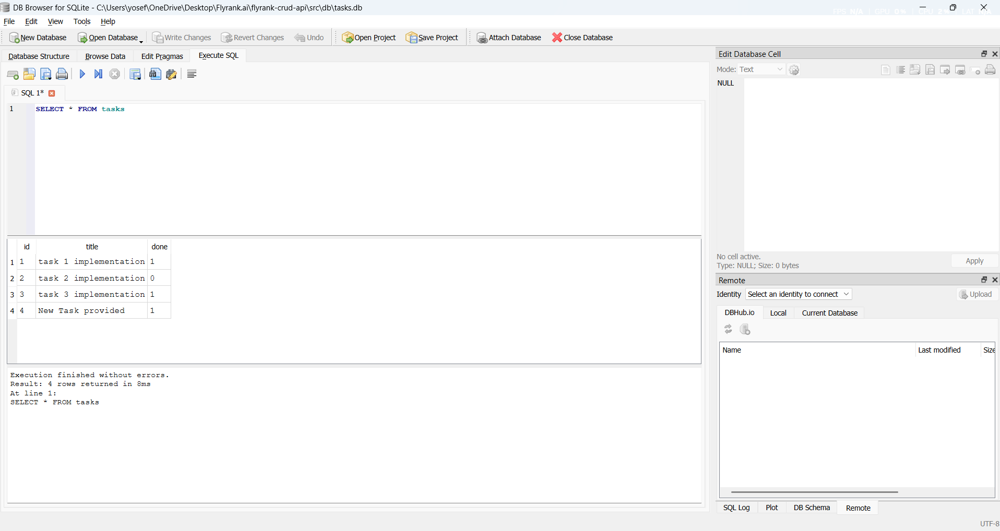

# Task API

A RESTful Task API built with **Node.js** and **Express.js** as part of the FlyRank Backend Internship.

The project was developed progressively across two assignments. It started as an in-memory CRUD API and was later upgraded to use a persistent SQLite database. The API supports creating, reading, updating, and deleting tasks, with Swagger documentation and SQL-based data persistence.

## Features

- RESTful API built with Express.js
- Complete CRUD operations
- Request validation
- Appropriate HTTP status codes
- Swagger UI / OpenAPI documentation
- API testing with `curl -i`
- Persistent SQLite database
- SQL-based CRUD operations
- Automatic database creation and seeding
- Database exploration using DB Browser for SQLite

## Technologies

- Node.js
- Express.js
- JavaScript
- SQLite
- better-sqlite3
- Swagger UI Express
- OpenAPI 3.0

---

# Week 1 — In-Memory CRUD API

The project initially implemented a complete CRUD API using an in-memory array.

At this stage, tasks existed only while the server was running. Restarting the application reset the task data.

## API Endpoints

| Method | Endpoint     | Description         | Success | Errors   |
| ------ | ------------ | ------------------- | ------- | -------- |
| GET    | `/`          | Get API information | 200     | —        |
| GET    | `/health`    | Check server status | 200     | —        |
| GET    | `/tasks`     | Get all tasks       | 200     | —        |
| GET    | `/tasks/:id` | Get a task by ID    | 200     | 404      |
| POST   | `/tasks`     | Create a new task   | 201     | 400      |
| PUT    | `/tasks/:id` | Update a task       | 200     | 400, 404 |
| DELETE | `/tasks/:id` | Delete a task       | 204     | 404      |

## Task Format

```json
{
	"id": 1,
	"title": "Learn Express",
	"done": false
}
```

## Creating a Task

### Request

```http
POST /tasks
Content-Type: application/json
```

```json
{
	"title": "Learn Swagger"
}
```

### Response

```json
{
	"id": 4,
	"title": "Learn Swagger",
	"done": false
}
```

A successful creation returns `201 Created`.

Invalid or missing titles return `400 Bad Request`.

## Updating a Task

A task can be updated by changing its title, completion status, or both.

```http
PUT /tasks/4
Content-Type: application/json
```

```json
{
	"done": true
}
```

Response:

```json
{
	"id": 4,
	"title": "Learn Swagger",
	"done": true
}
```

Successful updates return `200 OK`.

Invalid requests return `400 Bad Request`, while unknown task IDs return `404 Not Found`.

## Deleting a Task

```http
DELETE /tasks/4
```

A successful deletion returns:

```text
204 No Content
```

with an empty response body.

An unknown task ID returns `404 Not Found`.

## Swagger UI

Interactive API documentation is available at:

```text
http://localhost:3000/docs
```

Swagger UI provides a **Try it out** feature for testing the API endpoints directly from the browser.


## curl Testing

The API was also tested using `curl -i` to verify the HTTP status codes.

Example:

```bash
curl -i -X POST http://localhost:3000/tasks -H "Content-Type: application/json" -d "{\"title\":\"curl test task\"}"
```

The complete CRUD flow was verified:

```text
POST /tasks       → 201 Created
GET /tasks/4      → 200 OK
PUT /tasks/4      → 200 OK
GET /tasks/4      → 200 OK
DELETE /tasks/4   → 204 No Content
GET /tasks/4      → 404 Not Found
```

---

# Week 2 — SQLite Database

The second assignment extended the existing API by replacing the in-memory task storage with a persistent SQLite database.

The goal was to make task data survive application restarts and to learn how an API interacts with a relational database using SQL.

## Database Setup

The project uses **SQLite** through `better-sqlite3`.

The database contains a `tasks` table with three columns:

| Column  | Type                | Description                     |
| ------- | ------------------- | ------------------------------- |
| `id`    | INTEGER PRIMARY KEY | Automatically generated task ID |
| `title` | TEXT                | Task title                      |
| `done`  | BOOLEAN             | Stored as `0` or `1`            |

The database is stored in:

```text
tasks.db
```

The application creates this file automatically when it starts if it does not already exist.

The application also creates the `tasks` table automatically and inserts three example tasks when the table is empty. This prevents the seed data from being duplicated when the server restarts.

## Why SQLite?

SQLite was chosen because it is simple and well suited for this project.

- The entire database is stored in a single file.
- It requires no separate database server or additional setup.
- Data persists when the application restarts.
- It is lightweight and easy to use during development.

This makes it possible for someone to clone the project and start the API without manually installing or configuring a database server.

## Reading from the Database

The API was changed so that `GET /tasks` reads directly from SQLite:

```sql
SELECT * FROM tasks;
```

For a single task, the API uses a parameterized query:

```sql
SELECT * FROM tasks WHERE id = ?;
```

The `?` is a parameterized placeholder, and the ID is supplied separately.

Unknown task IDs continue to return:

```json
{
	"error": "Task not found"
}
```

with `404 Not Found`.

## Creating Tasks

`POST /tasks` now stores new tasks directly in SQLite:

```sql
INSERT INTO tasks (title, done) VALUES (?, ?);
```

SQLite generates the task ID automatically.

The validation from the original API was kept, so missing or invalid titles still return `400 Bad Request`.

Created tasks remain available after restarting the server.

## Updating and Deleting Tasks

Updating a task uses:

```sql
UPDATE tasks SET title = ?, done = ? WHERE id = ?;
```

Deleting a task uses:

```sql
DELETE FROM tasks WHERE id = ?;
```

The API continues to use the same HTTP behavior as the original CRUD API:

- `200 OK` for successful updates
- `204 No Content` for successful deletions
- `400 Bad Request` for invalid input
- `404 Not Found` for unknown task IDs

Because the data is stored in SQLite, changes remain after the server is restarted.

---

# Exploring SQLite with DB Browser

After implementing the database-backed API, the SQLite database was also explored directly using **DB Browser for SQLite**.

The database can be opened and queried through the **Execute SQL** tab.

Some of the SQL queries used during development were:

```sql
SELECT * FROM tasks;
```

```sql
SELECT * FROM tasks WHERE done = 1;
```

```sql
SELECT COUNT(*) FROM tasks;
```

```sql
UPDATE tasks SET done = 1;
```

```sql
DELETE FROM tasks WHERE done = 1;
```

### Example Query

One example query used during development was:

```sql
SELECT * FROM tasks WHERE done = 1;
```

This returns all tasks that are currently marked as completed.

Changes made directly in DB Browser are immediately reflected by the API without restarting the server because both the API and DB Browser access the same SQLite database file.



---

# Running the Project

The project does not require any manual database setup.

Clone the repository:

```bash
git clone https://github.com/yosefalsharawy/flyrank-crud-api.git
cd flyrank-crud-api
```

Install the dependencies:

```bash
npm install
```

Start the server:

```bash
npm start
```

The API runs at:

```text
http://localhost:3000
```

Swagger documentation is available at:

```text
http://localhost:3000/docs
```

When the application starts, it automatically:

1. Creates `tasks.db` if it does not exist.
2. Creates the `tasks` table if it does not exist.
3. Inserts three example tasks if the table is empty.

A fresh clone therefore requires no manual database configuration.

## Database File and Git

The local `tasks.db` file is git-ignored.

This means the database itself is not shared through the repository. Instead, the application contains everything required to create a new database automatically.

Each fresh clone therefore starts with its own SQLite database and three seeded example tasks.

---

# Project Structure

```text
flyrank-crud-api/

│
├── server.js
├── openapi.json
├── package.json
├── package-lock.json
├── README.md
├── swagger.png
├── database.png
└── .gitignore
```

`tasks.db` is created automatically when the application starts and is excluded from Git.

# Development Progress

The project evolved from a simple in-memory API into a persistent database-backed API:

```text
Week 1
  ↓
In-memory CRUD API
  ↓
Request validation
  ↓
Swagger / OpenAPI
  ↓
curl API testing
  ↓
Week 2
  ↓
SQLite database
  ↓
Database read operations
  ↓
Database insert operations
  ↓
Database update and delete operations
  ↓
Manual SQL exploration
  ↓
Automatic database creation and seeding
```

The final result is a CRUD API whose data persists beyond the lifetime of the Node.js process while remaining simple to set up and run.
